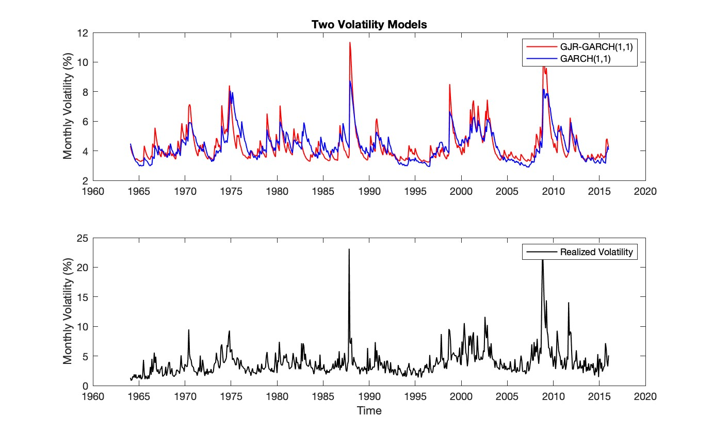
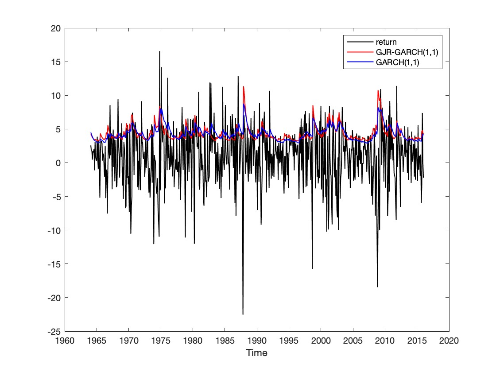

# Volatility-Model-Comparison

Financial volatility has several well-known facts. First, the volatility tends to stay at a high level if it is already high and at a low level if it is low. Second, volatility reacts differently to good or bad market times. When modeling volatility, we normally use ARCH and GARCH models. 

In the Matlab script, I used CRSP monthly CRSP-value-weighted portfolio return from the year 1964 to the year 2015, and we constructed the GJR-GARCH(1,1) model, and it takes this form:  

$$ r_t = \mu + \varepsilon_t $$

$$ \varepsilon_t = \sigma_t z_t, \quad z_t \sim \text{iid} \ \mathcal{N}(0, 1) $$

$$ \sigma_t^2 = \omega + (\alpha + \gamma 1_{\{r_{t-1} < \mu\}}) \varepsilon_{t-1}^2 + \beta \sigma_{t-1}^2 $$

The GJR-GARCH(1,1) model has an extra parameter $\gamma$, which captures asymmetry volatility's impact on significant price moves.

When estimating parameters, we used the MLE method under normal density. We constratined $\alpha + \frac{\gamma}{2} + \beta < 1$ into the MLE estimation.  
| parameter | point estimate |standard error |z value |
| ----------- | ----------- |----------- |----------- |
| $\mu$ | 0.0089818 |0.0015727 |5.7111 |
| $\omega$ | 0.00023979 |0.00018763 |1.278 |
| $\alpha$ | 6.8958e-08 |2.6166e-08 |2.6354 |
| $\gamma$ | 0.21128 |0.088907 |2.3764 |
| $\beta$ | 0.76602 |0.12475 |6.1405 |

We also estimate the standard GARCH(1,1) model by letting $\gamma = 0$, and we conduct a likelihood ratio test to see if this is a statistically significant restriction.  
$H_0: \gamma = 0$    
$H_a: \gamma \neq 0$  
We compute the statistic as 12.1211 and the chi-square critical value as 3.8415. It means we reject the null hypothesis. The parameter $\gamma$ is statistically significant.   

After estimating parameters, we also calculate the realized volatility from the daily CRSP-value-weighted portfolio return and aggregate them into the monthly volatility. 
$$ RV_t = \sqrt{\sum_{i \in \text{month}_t} r_i^2} $$

Ultimately, we plot the conditional volatility for GJR-GARCH(1,1) and GARCH(1,1) and realized volatility.

The figure shows that the GJR-GARCH(1,1) model indicates higher volatility in a certain period, which realized volatility is also high at that period. Further, we can examine the return series and plot two models and return together.

From here, we see that GJR-GARCH(1,1) models capture the impact of asymmetry volatility on large price moves. When in the bear markets(large price drops), the GJAR-GARCH(1,1) model generates "extra" volatility for that period compared with standard GARCH(1,1) model. 

